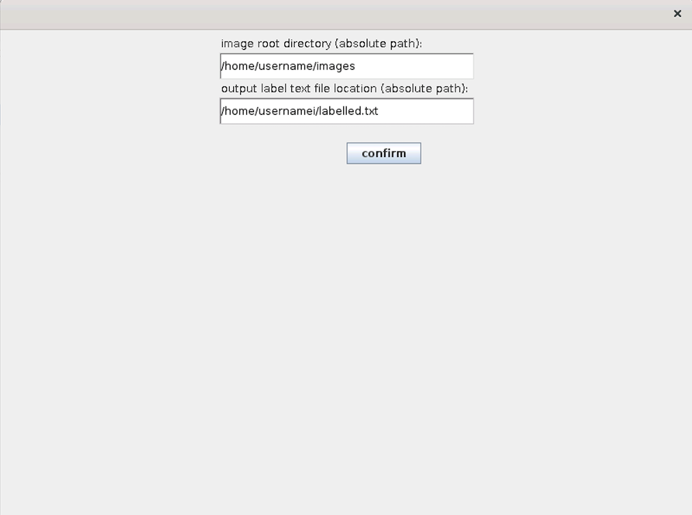
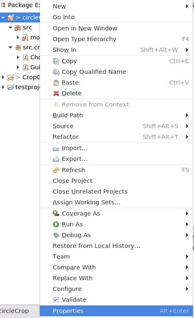
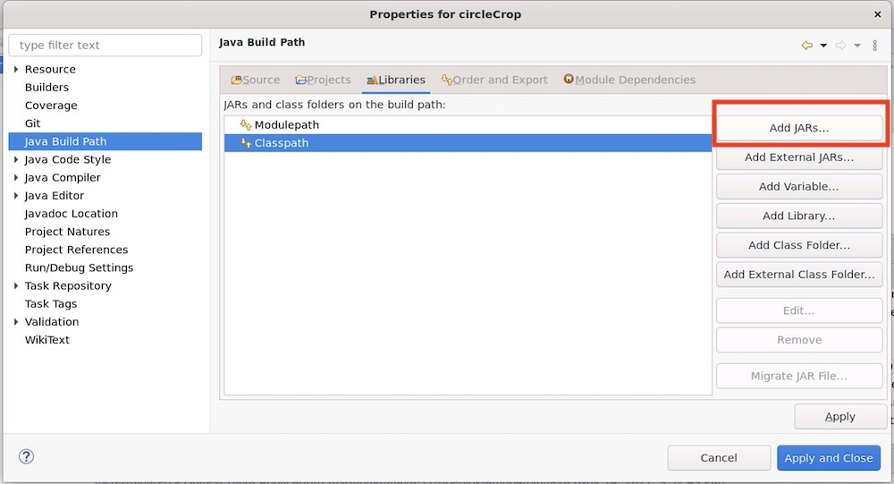
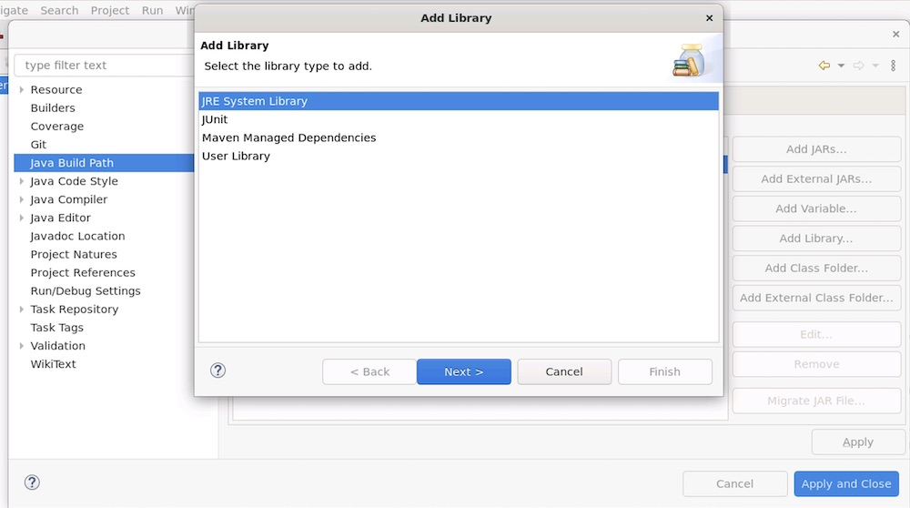
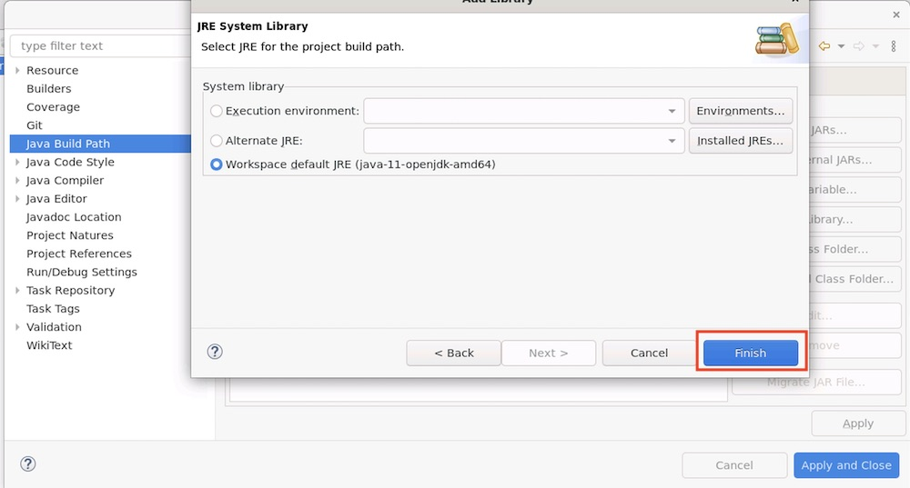

# Requirements
- eclipse
- openjdk 11
# How to use
## choose paths

## crop
- right click : next image
- left click : annotate
- mouse wheel : change radius

# How to compile

## 1. Clone this repository to eclipse workspace

## 2. Create New project named "circleCrop" (or the name of the cloned directory you specified).

## 3. Add missing JRE libraries
This SO answer might be helpful.
I couldn't find a way to properly include JRE library in git.
[https://stackoverflow.com/questions/4242641/jre-system-library-not-found-exception-in-eclipse](https://stackoverflow.com/questions/4242641/jre-system-library-not-found-exception-in-eclipse)

### 3.1 Right click the project and choose properties

### 3.2 click "Add JARs"

### 3.3 choose "JRE system library"

### 3.4 choose path of JRE you like
"Workspace default JRE" worked for me.

## 4. Now you can run and complile this project from "Run button" of your eclipse!